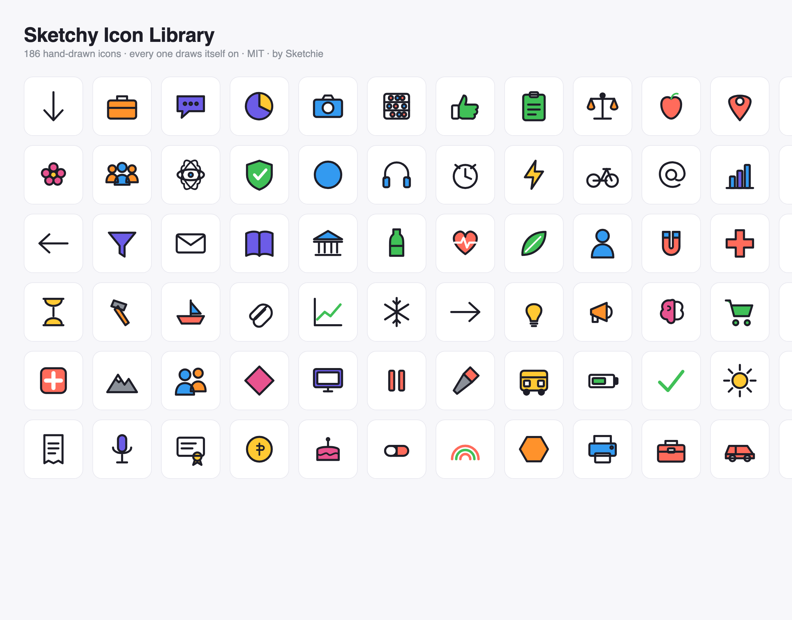

# Sketchy Icon Library

Hand-drawn-style SVG icons built for whiteboard-explainer video — every icon can **draw itself on**: the black outline strokes on first, then each color region washes in. Original vector work, **MIT licensed**, free for any use (commercial included, no attribution required).

By **[Sketchie](https://sketchie.ai)**.



**382 icons shipped** so far, across 29 categories — every one passes the draw-on contract validator. These are the first batches of a **10,049-concept taxonomy** ([`taxonomy.json`](./taxonomy.json)) the library fills over scheduled batches on the way to **10,000 drawn icons**. See [the roadmap](#the-10000-icon-roadmap) below.

## What makes these different

Most icon sets give you a finished shape. These are built in two stacked layers so a renderer can **animate the icon being drawn** — the exact effect that makes whiteboard-explainer video work. That structure is the whole point, and it's baked into every file:

```html
<svg viewBox="0 0 96 96" data-icon="rocket" style="color:var(--sk-ink,#1E1E28)">
  <g class="fills" stroke="none">            <!-- flat color, washes in per region -->
    <g class="fill" data-region="c1"> … </g>
    <g class="fill" data-region="c2"> … </g>
  </g>
  <g class="ink" fill="none" stroke="currentColor" stroke-width="5"
     stroke-linecap="round" stroke-linejoin="round">   <!-- outline, strokes on -->
    …continuous single-subpath geometry…
  </g>
</svg>
```

The draw-on contract, in three rules:

1. **Stroke paths are separate from fill regions** — never a shape that both fills and strokes. The outline (`.ink`) and the color (`.fills`) are independent layers.
2. **Every ink shape is one continuous `SVGGeometryElement`** a pen could trace end to end — so `getTotalLength()` + an animated `stroke-dashoffset` draws the outline on.
3. **Fills are grouped per color region** (`data-region`) so the wash-in can stagger region by region instead of appearing all at once.

Nothing forces you to animate them — they're perfectly good static icons — but if you want the draw-on effect, the geometry is already correct for it.

### The draw-on effect, in ~15 lines of CSS

```html
<style>
  .ink path, .ink line, .ink polyline, .ink circle, .ink rect {
    stroke-dasharray: 1000; stroke-dashoffset: 1000;
    animation: draw .6s ease forwards;
  }
  .fills { opacity: 0; animation: wash .4s ease .5s forwards; }
  @keyframes draw { to { stroke-dashoffset: 0; } }
  @keyframes wash { to { opacity: 1; } }
</style>
```

(For pixel-accurate per-region staggering, set `stroke-dasharray`/`stroke-dashoffset` from each element's real `getTotalLength()` in JS and fade each `data-region` group in turn — the grouping is there so you can.)

## Usage

**Grab a raw SVG file** — 382 of them in [`svg/`](./svg):

```html

```

**Or import the bundle** — every icon as an SVG string:

```js
import { SKETCHY_ICONS, getIcon, listIcons } from '@sketchie/icons';

const svg = getIcon('rocket');   // raw SVG string, or undefined
const all = listIcons();         // every shipped icon name
el.innerHTML = SKETCHY_ICONS['lightbulb'];
```

`icons.js` is a plain ES module (`export const SKETCHY_ICONS = { name: "<svg…>" }`) with no dependencies — you can also `import` it directly without the helpers.

### Recoloring

Colors are CSS variables with per-icon defaults, so one icon recolors per instance:

| Variable | Meaning | Default |
|---|---|---|
| `--sk-ink` | outline color | `#1E1E28` |
| `--sk-paper` | knockout / paper fill | `#FFFFFF` |
| `--sk-c1` | accent slot 1 | per-icon |
| `--sk-c2` | accent slot 2 | per-icon |

The palette is the 8-marker set: violet `#6C5CE7`, pink `#E8538F`, coral `#FF6B5B`, tangerine `#FF922B`, sunny `#FFC933`, leaf `#40C057`, sky `#339AF0`, graphite `#8A8F98` (plus ink + paper).

### What's in the box

| File | What |
|---|---|
| [`svg/*.svg`](./svg) | one file per icon (382) |
| [`icons.js`](./icons.js) | `export const SKETCHY_ICONS = { name: "<svg…>" }` |
| [`index.json`](./index.json) | `{ name → { file, category, tier } }` for the shipped set |
| [`taxonomy.json`](./taxonomy.json) | the full 10,049-concept target list (id, name, category, aliases, tier) |
| [`src/index.ts`](./src/index.ts) | `getIcon` / `listIcons` helpers over `icons.js` |
| [`preview.html`](./preview.html) | full contact sheet, grouped by category |

House style: flat color + ink outline, one concept per icon, 2–6 interior elements, silhouette-first. viewBox `0 0 96 96`, live area 8–88, ink stroke 5 (round caps/joins), max 2 accent slots. The silhouette has to read at 48px.

## The 10,000-icon roadmap

[`taxonomy.json`](./taxonomy.json) is the target list — **10,049 concepts across 151 categories**, tiered by how common they are in explainer content:

| Tier | Concepts | What |
|---|---|---|
| 1 | 1,735 | the everyday vocabulary — shipped first |
| 2 | 1,774 | common domain terms |
| 3 | 6,540 | the long tail |

**382 shipped**, tier-1 first. New batches land on a schedule and extend `icons.js` / `index.json` / `svg/` in place — the taxonomy is the map, and it fills in over time.

## Requests & contributing

The icons are generated from an internal authoring pipeline, so we don't take icon SVGs as pull requests — but **the roadmap is demand-driven, and requests move things up the queue.**

- **Need an icon?** [Open an issue](../../issues) with the concept (and, ideally, where in [`taxonomy.json`](./taxonomy.json) it lives, or that it's missing). Requested concepts get prioritized in the next batch.
- **Found a bad icon?** (silhouette doesn't read, wrong concept, contract violation) — open an issue with the name; we'll re-author it.

## License

[MIT](./LICENSE) © Sketchie ([sketchie.ai](https://sketchie.ai)). All original vector work — no traced or copied third-party icon set. Use it in anything, commercial or not, no attribution required.
